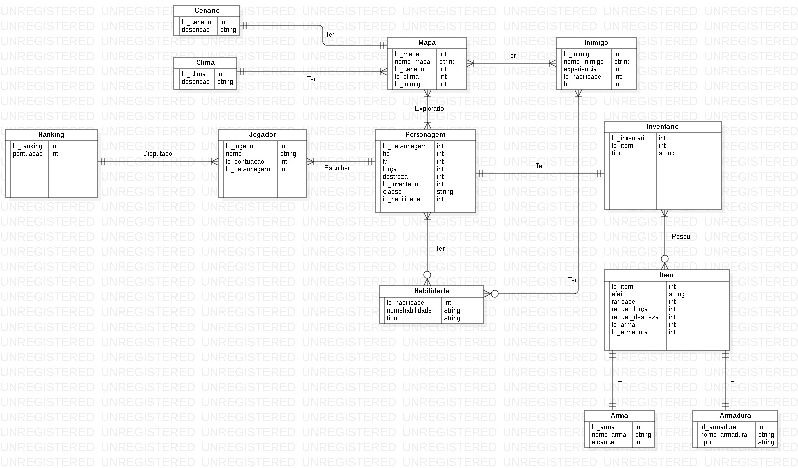
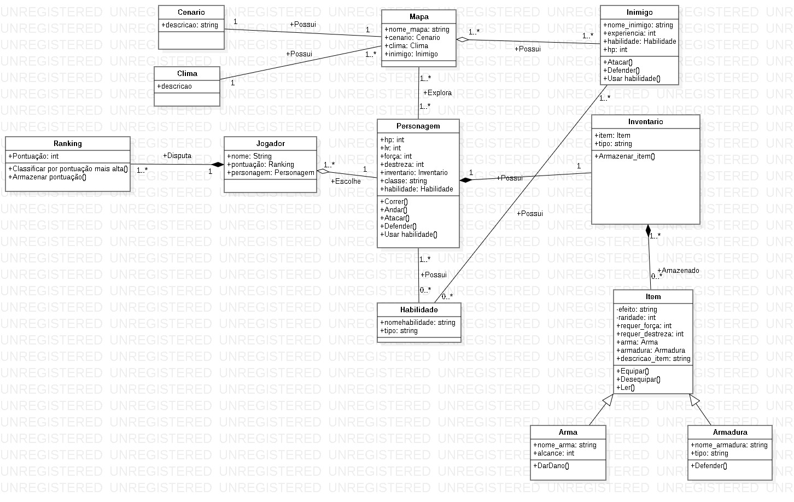

# LBDI4-Prova
Avaliação Prática de Mapeamento Objeto-RelacionalTarefa

Contexto do projeto:

-------Problema--------------

Atualmente o ensino de história vem se tornando cada vez menos atrativo para grande parte dos estudantes brasileiros por conta de sua metodologia de ensino exaustiva e pouco atrativa.

-------Objetivo--------------

Desenvolver um jogo digital que torna o ensino de história mais atrativo aos alunos, trazendo uma nova perspectiva e dinâmica de se aprender.

-------Descrição--------------

O projeto será um jogo didático em formato de RPG onde jogador tera que derrotar inimigos e coletar itens que possuiram conhecimentos e curiosidades da disciplina de história em suas descrições.

-------Funcionalidades--------------

1-> Título: Como jogador, preciso saber onde estou dentro do jogo?

    Critério de aceitação: Desenvolver um mapa que o jogador possa explorar clicando nas áreas já definidas como ponto de exploração.
    
    Definition of Done: O mapa deve possibilitar que ao jogador clicar em uma área já pre-definida ele possa explora-la
    
    
2-> Título: Como jogador, como darei ataques em inimigos?
    
    Critério de aceitação: Deve ser elaborado um botão de ataque que ao jogador clicar nele o personagem deve atacar o inimigo se estiver no turno do jogador
    
    Definition of Done: O jogador em seu turno deve conseguir atacar seu inimigo ao apertar o botão de ataque

3-> Título: Como jogador, como me defenderei do ataque do inimigos?
    
    Critério de aceitação: O jogador tem uma chance de se denfender quando o inimigo o ataca
    
    Definition of Done: O jogador deve conseguir se defender do ataque do inimigo
    
    
4-> Título: Como sistema, como saberei onde armazenar os itens que o jogador coletar
    
    Critério de aceitação: Deve ser elaborado um inventario para armazenar os itens que o jogador coletou 
    
    Definition of Done: O sistema deve conseguir armazenar os itens que o jogador coletar
    
    
5-> Título: Como jogador, como saberei que itens tenho no inventario
    
    Critério de aceitação: Deve ser elaborado um botão de inventario para visualizar os itens que o jogador coletou 
    
    Definition of Done: O jogador deve conseguir ver o inventario ao apertar no botão do inventario
    
    
6-> Título: Como jogador, como aprenderei história ao jogar?

    Critério de aceitação: Os conhecimento e curiosidades deve ser introduzidas nas descrições dos itens
    
    Definition of Done: Os itens deve possuir em suas descrições alguns conhecimentos e curiosidades da disciplina de história
    
    
7-> Título: Como jogador, como posso me movimentar no jogo?
    
    Critério de aceitação: Deve ser elaborado botões que permitão a movimentação de correr e andar para frente e para trás
    
    Definition of Done: O jogador deve conseguir se movimentar, correr e andar para frente e para trás
    

8-> Título: Como jogador, como posso escolher o personagem para jogar?

    Critério de aceitação: Deve ser elaborado personagens para o jogador escolher, cada personagem possui pontos de hp, lv, força, destreza, inventario, habilidades e uma classe  
    
    Definition of Done: O jogador deve conseguir escolher o personagem que o mais agradou por conta de seus atributos
    
    
9-> Título: Como jogador, como saber qual meu nível em relação aos outros jogadores?

    Critério de aceitação: elaborar um sistema de ranking que classifique os jogadores de acordo com sua pontuação feita ao longo do jogo
  
    Definition of Done: O jogo deve classificar a pontuação que os jogadores fizeram, da maior pontuação até a menor pontuação
    
    
10-> Título: Como sistema, como devo guardar as pontuações dos jogadores?

    Critério de aceitação: Deve ser elaborado um ranking para armazenar a pontuação dos jogadores
    
    Definition of Done: O jogo deve conseguir armazenar a puntuação dos jogadores
    
    
11-> Título: Como sistema, como devo criar os inimigos que o jogador enfrentara?
  
    Critério de aceitação: Deve ser criado inimigos que possuam um nome, hp, habilidades e a experiencia que dão ao serem derrotados
    
    Definition of Done: O jogo deve conseguir criar inimigos com nome, hp, habilidades e a experiencia que dão ao serem derrotados
    
    
12-> Título: Como inimigo, como darei ataques no jogador?
    
    Critério de aceitação: Quando chegar a vez do inimigo ele pode atacar o jogador
    
    Definition of Done: O inimigo deve conseguir desferir um ataque no jogador quando chegar a sua vez de agir

13-> Título: Como inimigo, como me defenderei do ataque do jogador?
    
    Critério de aceitação: O inimigo tem uma chance de se denfender quando o jogador o ataca
    
    Definition of Done: O inimigo deve conseguir se defender do ataque do jogador
    
    
  <h1 align="center">Diagrama MER</h1>
  

    
    
 
    
  <h1 align="center">Diagrama de Classe</h1>
  

    
    

 
